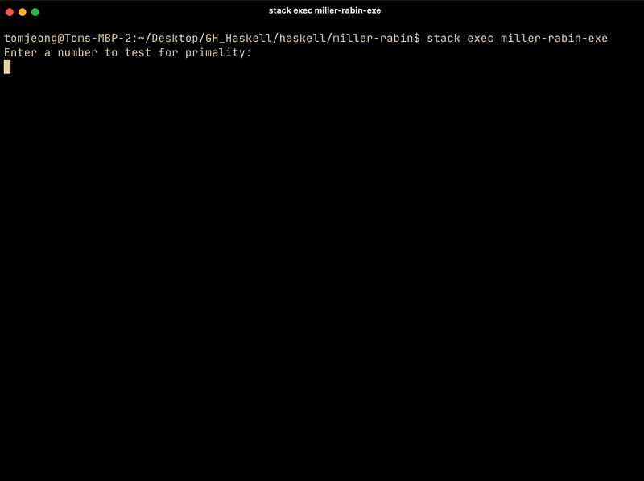

# Miller-Rabin Primality Test in Haskell

This repository contains a Haskell implementation of the Miller-Rabin primality test. This README provides instructions for students who may not have used Haskell before, guiding them through the process of running the `Main.hs` file.



## Prerequisites
To run the Haskell code, you need:

1. **Haskell Toolchain**:
   - Install the [Haskell Platform](https://www.haskell.org/platform/) or the GHC (Glasgow Haskell Compiler).
   - Alternatively, install `Stack` for managing Haskell projects (optional, not required for this guide).

2. **A Text Editor or IDE**:
   - You can use any text editor (e.g., VS Code, Sublime Text, or even Notepad++).
   - For a Haskell-specific environment, consider [Haskell Language Server](https://haskell-language-server.readthedocs.io/).

## How to Run `Main.hs`

1. **Clone the Repository**:
   ```sh
   git clone https://github.com/yourusername/miller-rabin.git
   cd miller-rabin
   ```

2. **Install GHC (If Not Already Installed)**:
   - On **Windows**:
     Download the installer from the [Haskell Platform](https://www.haskell.org/platform/).
   - On **macOS/Linux**:
     Use a package manager:
     ```sh
     # macOS
     brew install ghc

     # Linux (Debian/Ubuntu)
     sudo apt install ghc
     ```

3. **Run the Program**:
   ```sh
   runghc Main.hs
   ```
   This command will interpret and run the `Main.hs` file without compiling it.

4. **Optional: Compile the Program**:
   If you want to compile the program for faster execution:
   ```sh
   ghc -o miller-rabin Main.hs
   ./miller-rabin
   ```

## Example Usage
When you run the program, you may be prompted to input a number to test its primality. For example:

```sh
$ runghc Main.hs
Enter a number to check for primality: 17
17 is a prime number.
```

## Troubleshooting
- **GHC not found**: Ensure `ghc` is installed and added to your system's PATH.
- **Dependencies missing**: If your program uses libraries not included in GHC by default, you may need `cabal` or `stack` to install them.

## Learn More
- [Haskell Documentation](https://www.haskell.org/documentation/)
- [Miller-Rabin Algorithm](https://en.wikipedia.org/wiki/Miller%E2%80%93Rabin_primality_test)

Feel free to open an issue if you encounter any problems or have questions!
